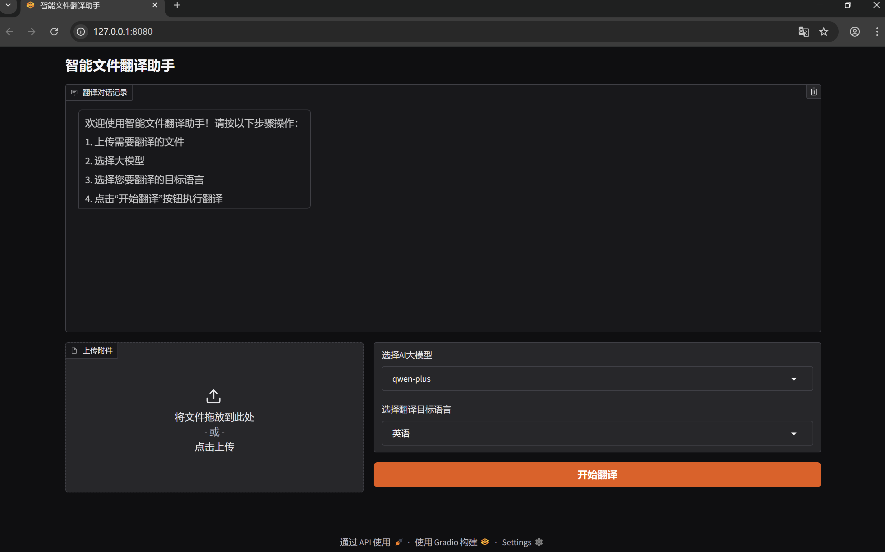
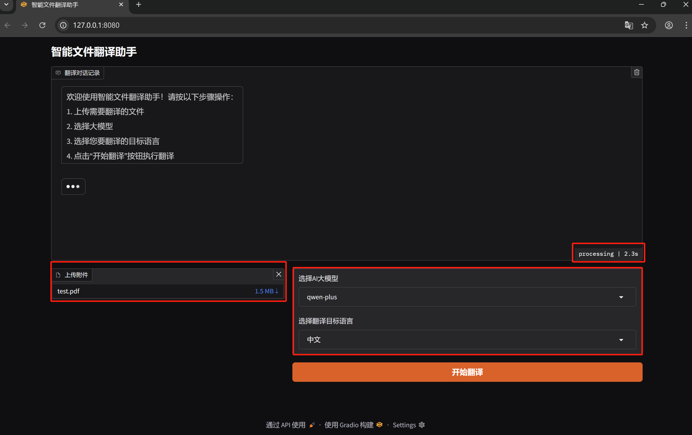
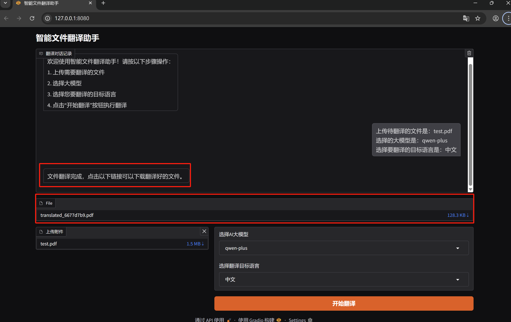
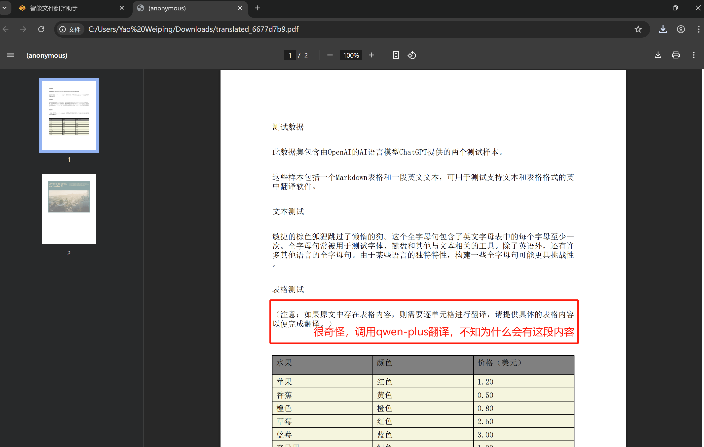
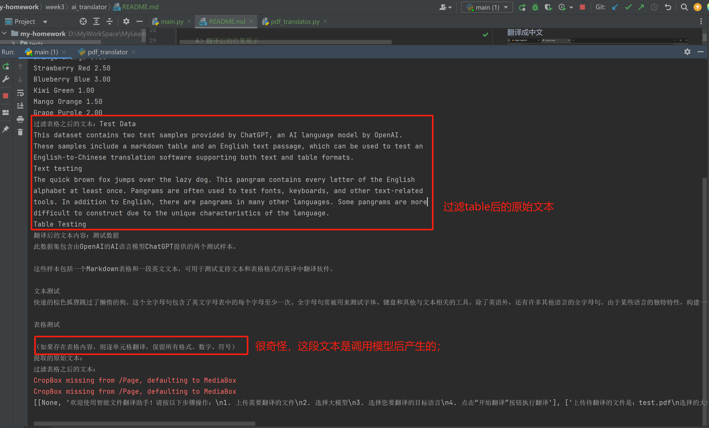
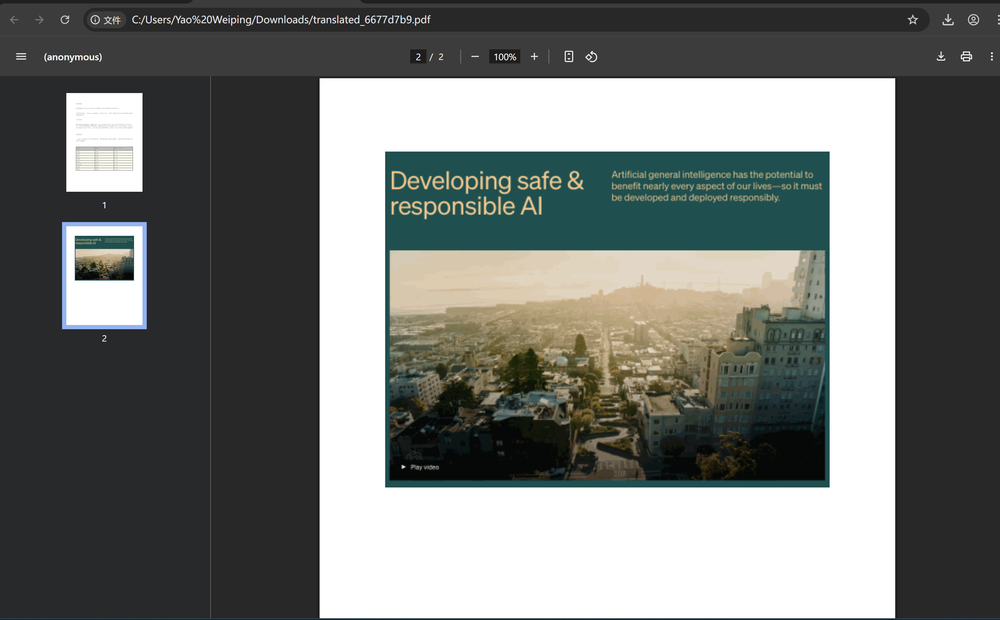
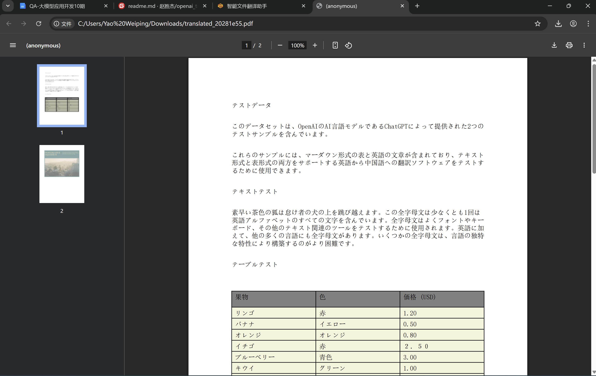
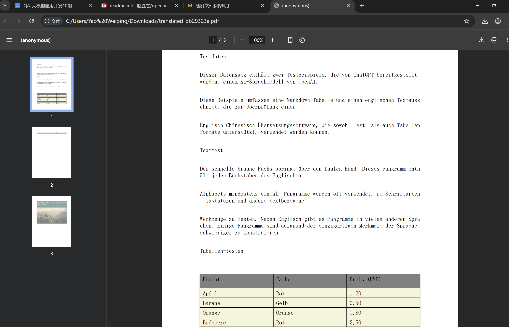

# AI智能文件翻译助手
## 1. 任务要求
    1）提供人机交互界面
    2）用户可选择要翻译的目标语言（比如：中文、日语、德语等）
    3）用户可选择/上传要翻译的PDF文件
    4）用户可根据需要选择不同的模型（方案中目前只提供阿里qwen-plus模型）
    5）用户点击”开始翻译“按钮后，执行PDF文件的翻译
    6）AI智能文件翻译助手翻译完毕后，提供翻译后的文件下载
    7）...
## 2. 技术方案
    python版本：3.12
    前端：使用gradio搭建人机交互界面
    后端：实现PDFTranslator类，该类主要功能是将PDF文件中的内容翻译成目标语言
## 3. 待优化/可扩展的功能（待完善）
    1）目前只提供了PDF文件的翻译功能，未来还可以支持doc、txt、ppt等文件
    2）目前模型只提供了阿里qwen-plus模型，未来可以继续扩展多种模型，供用户选择（比如支持deepseek、chat-gpt、智普等大模型）
    3）如果作为一个产品，还需要提供权限管控、token统计（主要是方便费用统计使用）、翻译后的PDF文件添加水印等功能
    4）...
## 3. 实现效果
    1）AI智能文件翻译助手人机交互界面

    
    2）用户选择上传要翻译的PDF文件、选择要翻译的目标语言、选择模型之后，点击”开始翻译“之后的效果
    

    3）翻译完毕之后，显式文件下载链接

    4）翻译后的结果展示
翻译成中文

日志输出记录

第二页图片原样输出

翻译成日语

翻译成德语
