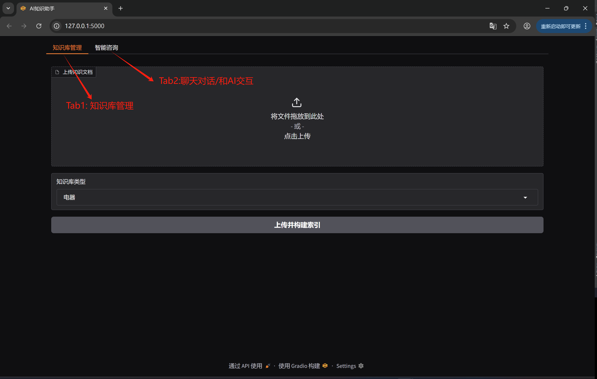
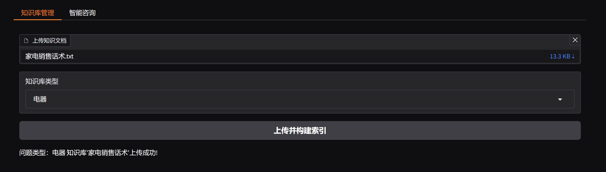
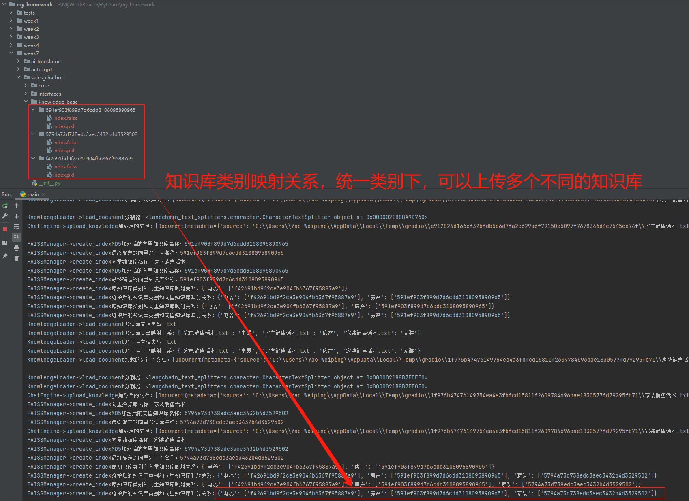
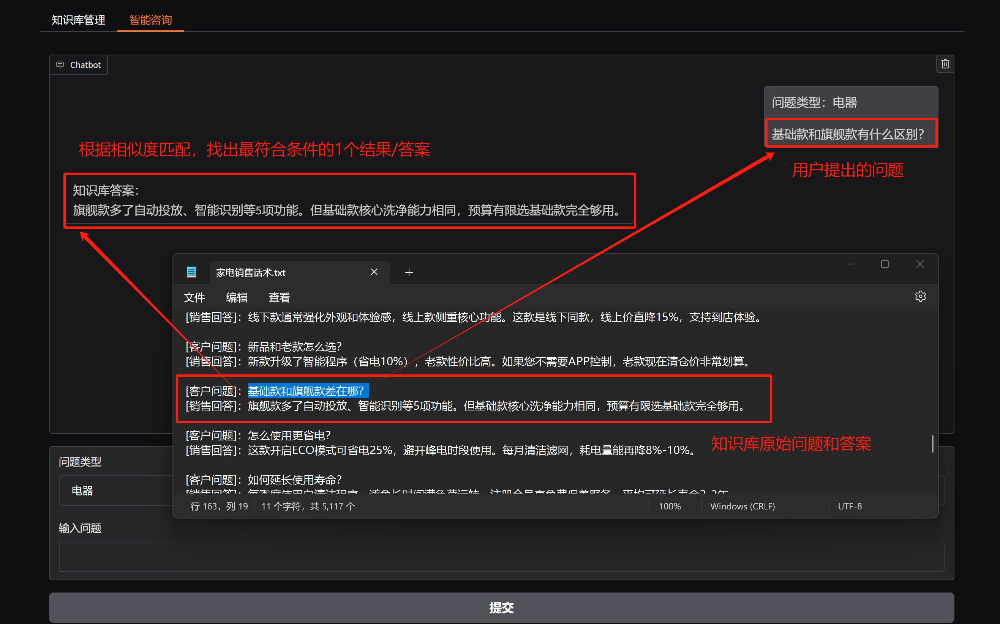
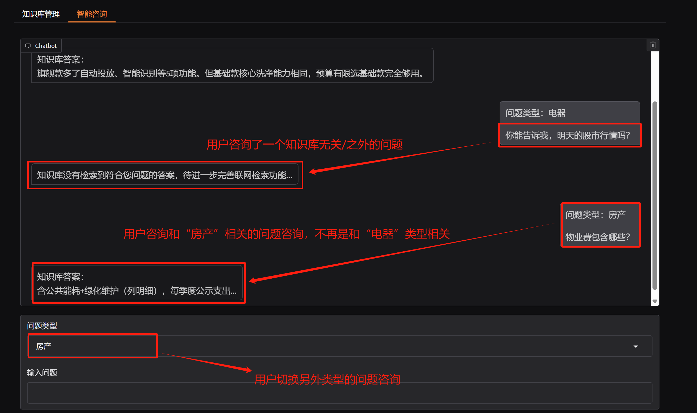

# AI销售机器人

## 项目背景

AI销售机器人项目是一个基于AI技术的智能对话系统，旨在为不同行业（如电器、家装、教育等）的销售场景提供智能化的客户服务和销售支持解决方案。该系统能够理解客户需求，提供专业的产品咨询，并根据企业的知识库内容给出准确的回答，从而提升销售效率和客户体验。

随着电商和线上咨询的普及，企业需要7×24小时在线的智能销售助手来应对客户咨询，同时确保回答的专业性和一致性。本项目通过LangChain框架构建，实现了知识库优先的检索机制，为不同行业的销售场景提供了可定制化的解决方案。

## 技术方案

### 技术栈
- **编程语言**: Python 3.12
- **核心框架**: LangChain
- **知识库检索**: LangChain的RetrievalQA
- **向量数据库**: FAISS
- **语言模型**: 阿里百炼大模型

### 项目结构

```
week7/
├── sales-chatbot/               # 项目主代码
│   ├── core/                    # 核心处理模块
│   │   ├── __init__.py
│   │   ├── chatbot_engine.py    # Chatbot聊天引擎
│   │   ├── document_loader.py   # 知识库加载器
│   │   ├── faiss_manager.py     # FAISS向量数据库管理
│   │   ├── search_engine.py     # 联网检索（待完善）
│   │   └── text_processor.py    # 文本文件处理（目前仅支持上传txt文档检索，未来可以扩展支持其他类型的知识库）
│   │
│   ├── interfaces/             # 数据管理
│   │   ├── __init__.py/        
│   │   └── gradio_ui.py        # 搭建Web UI
│   │
│   ├── knowledge_base/        # 向量知识库保存目录
│   │   ├── MD5(知识库名称1)/    # 将上传的知识库名称进行MD5加密后作为向量知识库的目录（该目录下保存index.faiss和index.pkl两个文件，新版本功能）
│   │   ├── MD5(知识库名称2)/    # 如上
│   │   └── .../               # 如上
│
├── __init__.py
├── main.py                   # main程序入口
├── 家电销售话术.txt            # 家电类型的测试知识库文档
├── 家装销售话术.txt            # 家装类型的测试知识库文档
├── 房产销售话术.txt            # 房产类型的测试知识库文档
└── README.md                 # 项目说明文档
```

### 核心功能实现

1. **上传知识库核心功能**:
```python
    def create_index(self,
                     category: str,
                     documents: List[Document],
                     embeddings: np.ndarray,
                     index_name: Optional[str] = None):
        """
        :param category: 知识库文档类别
        :param documents: 文档列表
        :param embeddings:
        :param index_name:
        :return:
        """

        # 考虑到上传的知识库含有中文等特殊字符，所以需要多上传的知识库进行MD5加密
        print(f"FAISSManager->create_index向量数据库名称：{index_name}")
        index_name = md5(index_name.encode("utf-8")).hexdigest()
        print(f"FAISSManager->create_indexMD5加密后的向量知识库名称：{index_name}")

        # 生成唯一索引名
        if not index_name:
            index_count = len(self.type_mapping.get(category, []))
            index_name = f"{category}_{index_count}"

        print(f"FAISSManager->create_index最终确定的向量知识库名称：{index_name}")

        # 创建FAISS索引
        texts = [doc.page_content for doc in documents]
        db = FAISS.from_texts(texts=texts, embedding=embeddings)
        # 保存索引文件
        """
        在较新版本的 langchain_community.vectorstores.faiss 中，save_local() 方法的参数签名已经发生了变化，
        不再接受 file_name 参数。相反，它现在只需要 folder_path 参数，索引会自动保存在该目录下的 index.faiss 和 index.pkl 文件中
        比如：FAISS 索引文件将保存在 ./index_dir/index_name目录下
        包含 index.faiss 和 index.pkl 两个文件。
        """
        index_path = os.path.join(self.index_dir, index_name)
        db.save_local(folder_path=index_path)

        print(f"FAISSManager->create_index原知识库类别和向量知识库映射关系：{self.type_mapping}")

        # 维护类型映射
        if category not in self.type_mapping:
            self.type_mapping[category] = []
        if index_name not in self.type_mapping[category]:
            self.type_mapping[category].append(index_name)

        print(f"FAISSManager->create_index维护后的知识库类别和向量知识库映射关系：{self.type_mapping}")
        pass
```

2. **从FAISS向量数据库检索答案核心逻辑**:
```python
    def search_index(
            self,
            category: str,
            query: str,
            embeddings: np.ndarray,
            top_k: int = 1
    ) -> Optional[List[Tuple[str, float]]]:
        """
        使用 as_retriever() 方法进行向量检索 - 返回相似度最高的前k条结果

        :param category: 文档类别
        :param query: 查询文本
        :param embeddings: 嵌入模型
        :param top_k: 返回结果数量
        :return: 前5个匹配内容列表 或 None
        """
        # 输入验证
        if not query or not category or top_k <= 0:
            return None

        # 1. 加载索引（带缓存）
        if not hasattr(self, '_retriever_cache'):
            self._retriever_cache = {}

        if category not in self._retriever_cache:
            retrievers = []
            for index_name in self.type_mapping.get(category, []):
                index_path = os.path.join(self.index_dir, index_name)
                try:
                    db = FAISS.load_local(
                        folder_path=index_path,
                        embeddings=embeddings,
                        allow_dangerous_deserialization=True
                    )
                    # 创建检索器并设置top_k参数
                    retriever = db.as_retriever(
                        search_type="similarity_score_threshold",
                        search_kwargs={
                            "k": top_k,
                            "score_threshold": 0.3
                        }
                    )
                    retrievers.append(retriever)
                except Exception as e:
                    print(f"加载索引 {index_name} 失败: {str(e)}")
                    continue

            if not retrievers:
                return None

            self._retriever_cache[category] = retrievers

        retrievers = self._retriever_cache[category]

        # 2. 执行检索
        all_results = []
        for retriever in retrievers:
            try:
                # 使用retriever获取结果
                docs = retriever.get_relevant_documents(query)
                all_results.extend([
                    (doc.page_content, doc.metadata.get('score', 1.0))  # 从metadata中获取分数，默认1.0
                    for doc in docs
                    if hasattr(doc, 'page_content')
                ])
            except Exception as e:
                print(f"检索异常: {str(e)}")
                continue

        if not all_results:
            return None

        # 3. 去重处理（保留最高分）
        unique_results = {}
        for doc, score in all_results:
            if doc not in unique_results or score > unique_results[doc]:
                unique_results[doc] = score

        # 4. 按分数排序并返回前top_k个结果
        sorted_results = sorted(unique_results.items(), key=lambda x: x[1], reverse=True)
        return sorted_results[:top_k]
```

## 实现效果

### AI销售机器人交互界面

*图1：共2个选项卡，选项卡1为上传知识库管理界面。选修课2为人工智能交互界面。*

### 上传电器类知识库

*图2：用户可以根据知识库类型，选择要上传的知识库*

### 上传不同类别知识库（知识库类别映射关系）

*图3：同一个类别，支持上传多个不同名称的知识库*

### 智能检索/AI交互


*图4：根据相似度匹配，检索到相似度最大的1个答案。图5：没有检索到答案以及切换其他类别的问题咨询。*

## 待扩展功能

1. **联网检索功能扩展**
   - 当知识库无匹配时自动调用搜索引擎API获取最新信息
   - 搜索结果可信度评估和过滤机制

2. **多文档类型知识库适配增强**
   - 扩展支持多种类型的知识库文档

3. **多模型选择**
   - 当前项目只支持阿里百炼大模型
   - 支持DeepSeek、智普、OpenAI等主流大模型
   - 用户可以根据各自的爱好选择不同的大模型

4. **AI回复优化**
   - AI从知识库检索到的答案，交予大模型润色，使之回复更有温度