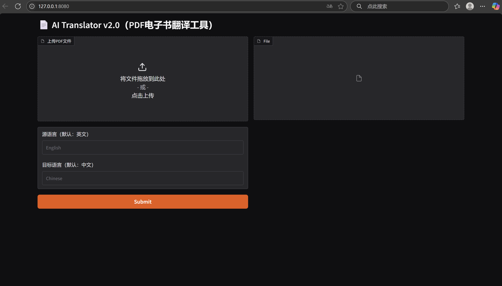
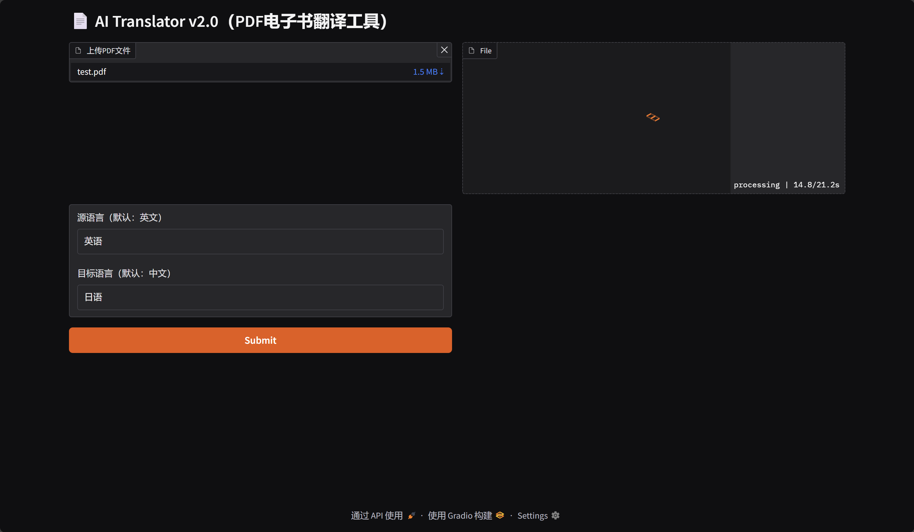
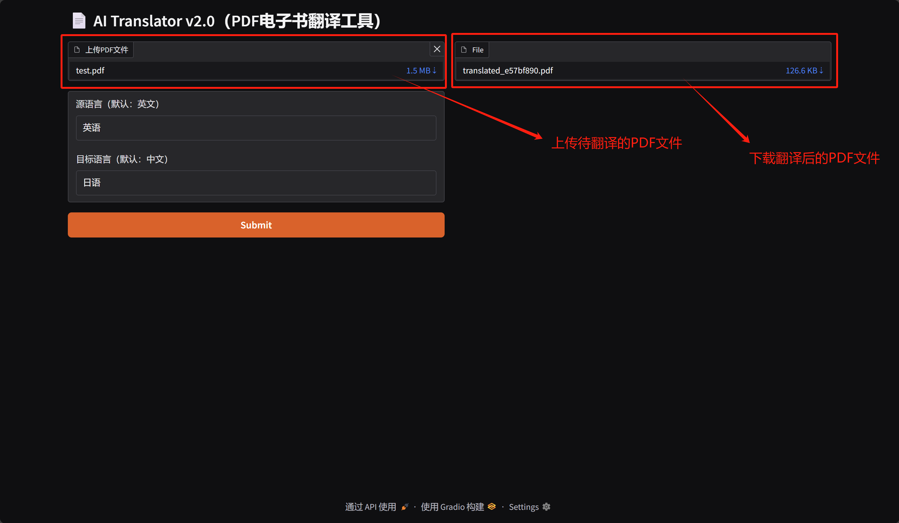
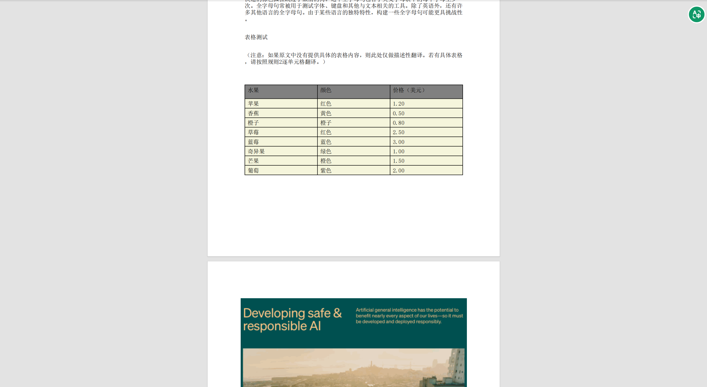
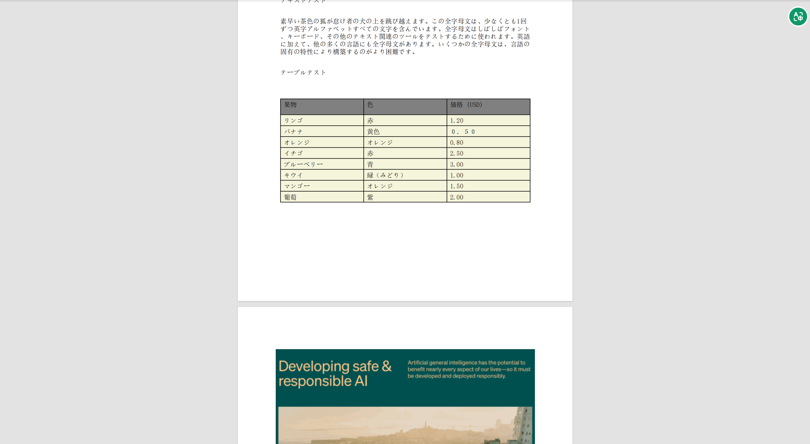

# AI Translator v2.0 (PDF电子书翻译工具)

## 项目背景
AI Translator v2.0（PDF电子书翻译工具）是一个基于AI技术的智能翻译工具，旨在为用户提供多语言翻译解决方案。用户只需上传待翻译的文件，输入要翻译的目标语言即可。

## 技术方案
### 技术栈
- **编程语言及版本**：python 3.12
- **核心框架**：LangChain
- **LLM大模型**：qwen-plus
- **向量数据库**：FAISS

## 项目结构
~~~
week8/
├── ai_translator/                # 项目主代码
│   ├── files/                    # 翻译后的目标文件存放目录
│   │   ├── translated_806205f4.pdf
│   │   ├── 
│   │
│   ├── fonts/                 # 字体文件夹     
│   │   └── simsun.ttc         # 字体文件
│   │
│   ├── temps/                 # 临时文件夹（存放原始文件中的图片等临时文件）
│   │   ├── 4b1821b4.png       # 临时图片文件
│   │   ├── 10fc918c.png       # 临时图片文件
│   │   └── ...                # 如上
│   ├── translators/           # 核心功能
│   │   ├── __init__.py
│   │   ├── pdf_translator.py # PDF文件翻译
│   │   └── ...               # 如上
├── __init__.py
├── main.py                   # main程序入口
├── test.pdf                  # 测试附件
└── README.md                 # 项目说明文档
~~~

## 核心功能实现
    略...

## 实现效果

### 交互界面

*图1：人机交互界面，用户可上传待翻译的PDF文件、用户可输入源文件语言、要翻译的目标医院*

### 文件翻译

*图2：系统正在执行翻译工作。从人机交互界面上显式进度*

### 下载翻译后的附件

*图3：翻译后的PDF文件，用户可点击链接下载到本地浏览/查看*

### 英语翻译成中文

*图4：英语翻译成中文的效果*

### 英语翻译成日语

*图5：英语翻译成日语的效果*